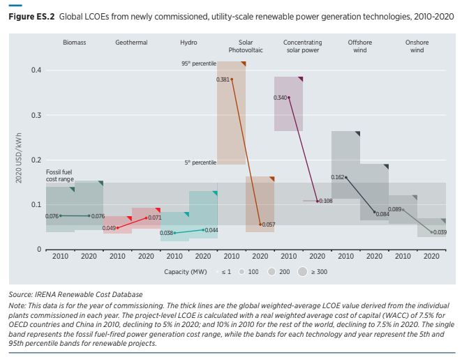
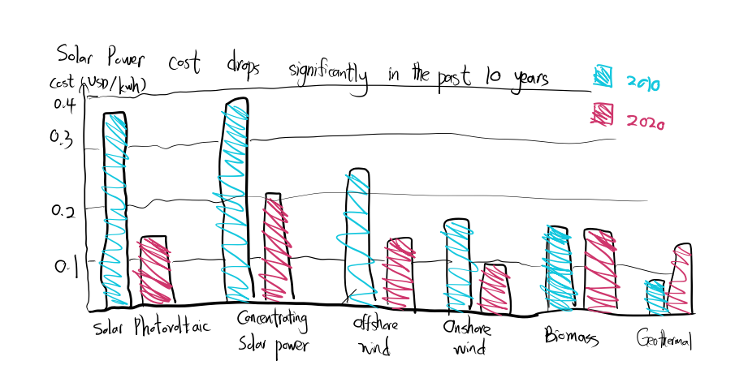
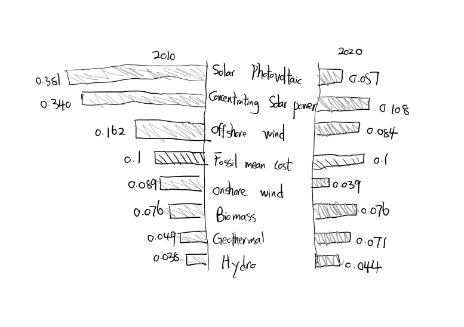

# Original data visualization

    

This figure is tring to show the global cost of renewable power generation's change between 2010 and 2020. It includes all the information needed, but it still makes readers confused.
# Why this figure is confusing
1. Its X axis is very weird, which is a repeated pattern of year 2010 and 2020. Most readers will not think that way, and thus it may take readers a few time before they come to realize what it is trying to say. 
2. It has a confusing range of color for each new power generation technologies, later I realized it is the 5th percentile to the 95th percentile. While 5th percentile and 95th percentile may be important in statistics, it is useless here. The whole report didn't use 5th percentile and 95th percentile, it only focuses on mean.  
3. It is also confusing by adding another range of fossil fuel cost range, which overlapped with much of the areas of each new energy.  
# What I am trying to improve
First, I will remove the percentile, while it may be important in statistics, it means nothing here. The only thing we want to show is the change between the 10 years, so we may only need the mean. So I only need the mean. 
The second thing I will use a better way to illustrate the X axis. It is very confusing now, so I want to put the new energy names as the X axis, while use two different colors to show 2010 and 2020 respectively. 
Third, I may use a different graph. For example, histogram. Histogram may be more useful to show readers the quantity. But there are many sorts of histograms, I choose two of them and draw the sketches as follows: 
# sketch out a solution and feedback from others

    

In this sketch, I tried to use two colours to represent the two years, and use different energies as X-axis. I also try to use a more straightforward title. Since I believe my audience should be those who are interested in investing new energy power plants, I directly put the title as the two energy whose cost dropped most significantly. I also use a sequence from the largest drop of cost to the smallest drop( or even increase). I choose the two colours randomly, I am not sure which colour pattern should be the best. I asked a few friends the following questions: " Can you understand this figure?" "Which part do you like best?" "Is there anything makes you feel confused?" "Do you think there is anything cna be improved?" 
 
Below is feedback from my three friends and feedback from in-class group discussion. 
 
Student A(from energy enigneering and public policy program) "It is a clear data visualization over all. I can understand what you are showing. It is simple but clear. But I believe it will be better if you can put labels on each coloumn. It will be perfect if you can add a percent of change. Maybe you can also try to add a broken line to show the change. Well, forget about the last recommendation, it will make it worse."  
 
Student B(from INI) "It makes me confused that the title only covers two power but the X axis covers too many energies. Just look at the title, I will expect that the X axis should be a list of years. That's why I spend a little time figuring what it is talking about. Other things are fine. By the way, I love the colors, it is pretty!"  
 
Student C(from MISM) "I can understand this figure. The first one is much better than the second one. For we are comparing the change of the same sort of energy. There are al least two points can be improved for the first figure. First, the title should including the whole figure istead of a conclusion. Second, if you want to emphasize on certain energy, you can change its colour or circle it." 
 
Group from class "It is beautiful and it clearly conveys the necessary information. It is a little confusing of the unit of the Y-axis, does it in dollar or cents? "Adding a label will definitely make the figure more clear." "Maybe you can try to use an overlapped between the two years to show the change part. Or, but there are also some energies have the cost increase, then overlapping may be a little confusing." 
 

    

In this sketch, I tried to put all the 2010 data points on the left, and all the 2020 data points on the right. By dividing the two years, I hope it can help readers better compare between different energies. I choose to use grey as the colour, because here I don't want to make a conclusion for readers, I am expecting they will get their own conlcusion by comparing different energies. 
 
Below is feedback from my three friends and feedback from in-class group discussion. 
 
Student A(from energy enigneering and public policy program) "This figure is a litte more confusing than the former one. I will suggust that you can add the change in percent or quantity in the right column. It is really difficult to compare between the left and the right, if they have similar length."  
 
Student B(from INI) "Compared to the former figure, I spend more time figuring out what this one is trying to say. It is also uglier. The left column has a clear sequence from the highest cost to the lowest cost, but the right part is really confusing. I didn't get what you are tring to represent. Maybe it is because there is no clear comparision between the two years, so I can't understand the specfic quantile of the changes."  
 
Student C(from MISM) " Figure two is much worse than the first one, it is not suitable for horizontal comparision."
 
 
Group from class "No! This one is much more terrible than the former one." 
# Conlusion from feedback
1)I decied to use and improve figure one. One reason is that the story I want to tell is about the change over time, not the difference between energies. So figure one can help me better realize this function. All the viewers agree that figure one is more clear. 
 
2)Two viewers suggest that a better title is needed. Thus I will use a title that include all the data shown, and use a subtitle to try to make my readers focused on the two energies that have the largest changes.  
3)Two viewers suggest labels is necessary, so I will add labels to show each quantity.  
4)The Y axis need a more clear units. So I change the Y-units to be US dollar/kwh, which may be more clear to readers.   
5)Two viwers think it will be better to add something to represent its change. I try to add it, but I find after adding it, it will make the whole figure a little confusing. When we try to represent percentage and values in the same figure, it will make people don't know which one fo focuse on. And, the qunatity of change is large enough to show people the degree of cost drop  
6)I will keep the color pattern, because one viewer thinks the colour pattern is beautiful!
# Final work

[Back to main page](/README.md)
