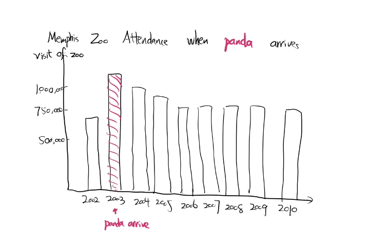
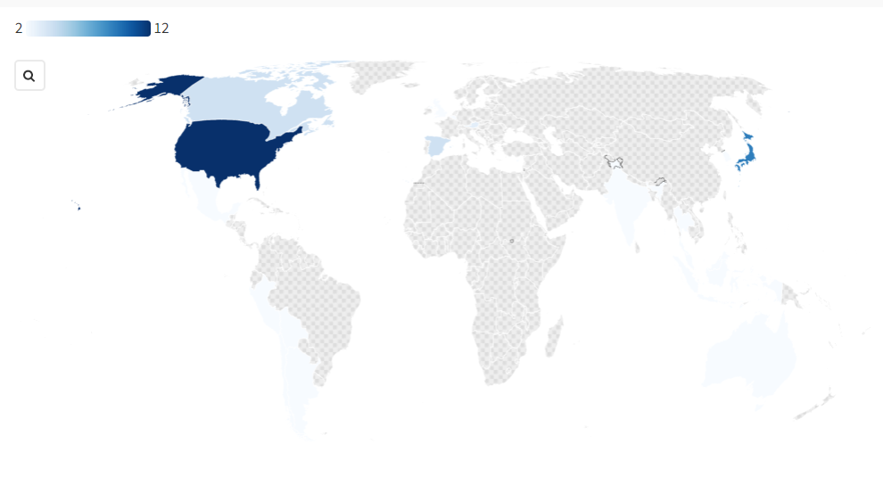
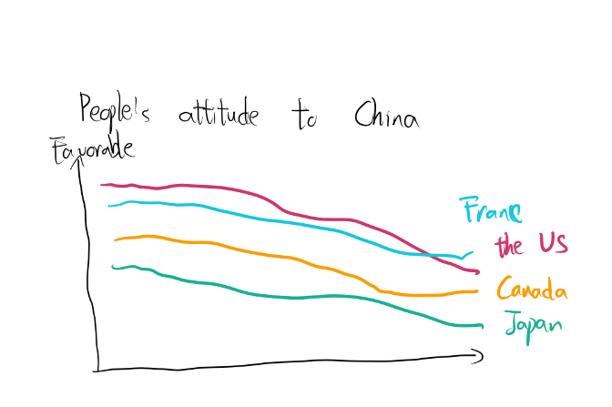

# Part 1
# Outline for project
I want to tell a story about pandas. Pandas are not only cute, but also widely adored by people all over the world. In fact, as a symbol of China, pandas are widely used in diplomacy policy as a bridge to communicate with other countries. "Panda diplomacy" describes this situation. In today's world, there are constant disputes among people and countries, and it is difficult to get an answer to many ideological differences in a short period of time. But at least, on pandas, the attitudes of people all over the world are highly consistent. People like his cute naivety, and also like his peace and friendliness. So, by telling the story of the panda, I want to make people stop and think about what can become a way of communication between different nations. Pandas have given us an excellent answer. They may not be strong enough to defeat the huge devisions, but if we keep finding "pandas", the situation will beomce better. 
 
Story Structure 
Setup: Pandas are widely adored by people from all over the world.  
 
Conflict: In today's world, differences between nations and nations are widespread and difficult to reconcile. 
 
Resolution: "Panda Diplomacy" can be an excellent example for reference. For people from different countries, there must be some common love shared by people. We can use this as a breakthrough to build a brigde for communication.  
 
Result: Although "Panda Diplomacy" has some effects, it is too weak when confronting geopolitical conflict and competition.

# Sketch
1)

    

I use a column chart here to show how people welcome pandas. I use red to show the specific time after panda arrives Memphis Zoo, and try to show the change before and after this certain event. 
2) 

    

I am using a world map here to show the number of pandas outside China in one certain year. I will use similar maps to show number of pandas outside China in several years to present the change over time. I will also use the similar map to show the countries that has diplomatic relationships with China to compare them with the coutries have pandas as gift from China. I try to use to show "panda diplomacy" do have a implication at the early stage. 
3)

    

I am using a line chart here to show the trend of people from countries which owns the most pandas given by China. Although people loves panda, but when it comes to ideological divisions and economic competition, "Panda Diplomacy" is too weak to change people's attitude towards China. 
 

# Data Source
1. [Data of how people love and accept pandas](https://go-gale-com.cmu.idm.oclc.org/ps/i.do?id=GALE%7CA126612060&sid=googleScholar&v=2.1&it=r&linkaccess=abs&issn=08963703&p=AONE&sw=w&enforceAuth=true&linkSource=delayedAuthFullText&userGroupName=cmu_main&u=cmu_main). Here I use a data from University of Memphis in 2004 done by Jeff Wallace and Andrea Orchik. They include an "Impact of Giant Pandas on Memphis Zoo Attendance" which shows an siginificant increase in 2002 when giant pandas come.  
2. [Data on when China establish diplomatic relations with other countries](https://www.fmprc.gov.cn/web/ziliao_674904/2193_674977/200812/t20081221_9284708.shtml) Here is a list of the time China establish relationship with other countries. I want to use this list to compare with a list of the time China giving or renting pandas to other countries. [Pandas outside China](https://en.wikipedia.org/wiki/Giant_pandas_around_the_world) Unfortunately, I couldn't find more detailed information of this, I may need to type it into a list which can be used. 
3. [Data on World's attitude to China](https://www.pewresearch.org/global/2019/12/05/attitudes-toward-china-2019/) This data shows how people from all over the world view China in 2019. Due to geopolitics, it is clear that most countries don't like China.

# Method
I will use Shorthand to create my final presentation. I will use Tableau and Flourish to create my data visualiztions. I plan to use Scrollmation to show the changes of the countries which has diplomactic relationship with China over time. And I may use a scrollpoints to show a world map, and focuse on the the countries which has panda sent from China.

# Acknowledgement
I am trying my best to tell a story about peace and love, but data is limited and it seems panda didn't bring that much understanding of people around the world to China. I may change a perspective to tell a more complete panda story due to the above reasons, but I am also thinking of leave a "bad end" for my story. In our real life, there isn't always a perfect fairy-tale ending. Maybe what we need is more "pandas" and more people willing to share thoughts through "pandas".
 

# Part 2

# Wireframes
[Check my draft wireframes here!](/draft.pdf)

# User Research Protocol

**Target Audience:** Policy Students who wants to contribute to diplomacy and policy decision-makers reatled to diplomacy 

**Approach to indentifying representative individuals to interview:** Due to the limit of time, I can only reach to my friends. So I choose my three friends with policy; business and technology background, to find out what people from these backrgounds may think of my project. 

# Interview Question Purpose

| Question     | Purpose |
| ----------- | ----------- |
| 1. Which part is the most beautiful/attractive? | I want to know which part is the most successful, so I may use the experience in other parts.|
| 2. What do you think is the purpose of this presentation?   | I want to know if my figures and words are straightforward enough for first-time readers, we only have one minute, and that's why I want to fully utilize the time.|
| 3. What do you feel confusing about?   | I want to know if I have made everything clear, is there anything needs to further explained?      |
| 4. What would you change? Any suggestions for improvement?   | I want to know readers' opinions that will make them more comfortable, and I will use them as advice to better improve my presentation.|
| 5. What do you want to know further after my presentation? What made you curious?    | I want to know if there is any new topics can be further investigated.|

**How is it used?** I will first ask my respondents to go over my wireframes, and ask them the first three questions to check the advantage and disadvantage of my draft. And then I will go over it as I am presenting, and ask them question 4 and question 5, to get more advice and suggestions to finetune my project.

# Interview script

| Question     | Student 1 from energy and policy engineering | Student 2 from INI| Student 3 from MISM|
| ----------- | ----------- |----------- |----------- |
| 1. Which part is the most beautiful/attractive?     | The alluvial graph is fantastic and straightforward, it is a good way to represent the relationship between trade and owning of pandas. |The alluvial graph. It is cool and it could be perfect if given a tiny change. |I love the maps most, it conveys a clear information.|
| 2. What do you think is the purpose of this presentation?   | Its a objective representation of a factual outcome, that's it.|I am not sure about the purpose, it is just a story about "panda diplomacy" | Introduction to Panda Diplomacy, the title has included all the information needed for the pandas diplomacy.|
| 3. What do you feel confused about?   | For the first figure about attendance of Memphis Zoo, is the increase of attendance are really because of pandas, or other factors? For the two maps, I can't tell which countries that has pandas and has diplomacy relationships with China at the same time. The countries with small area size, I can't see very clearly which country has pandas.|There is no conclusion in the end, it is just a combination of facts. The first figure may not be able to fully represent that pandas are popular, there may be other reasons.|The title is a little confusing, these two parts are not mutually exclusive. The alluvial is confusing. Alluvial is used for representing flowing, it should be steps by steps. Here it is confusing. And the scale is not good, whatever number is large or small, they contain the same length. |
| 4. What would you change? Any suggestions for improvement? |I want to combine the two maps together overlapped to better compare them. And you can use the number of the countries next to the figure to better illustrate your outcome. Use different colours to represent if a country has diplomacy with China/ if it has pandas/ if it has pandas as well as diplomacy relationship.|I would suggest change the two maps' location, I will scan from left to right, and thus I will think you should put the more important part at the left. The alluvial graph, can you put "no" at the bottom, and put the rest part together.|Change the second part of title into a failing political tool. You can use a scatter plot to show the relationship of trade and pandas.|
| 5. What do you want to know further after my presentation? What made you curious?    | Other metrics of pandas and zoos, I still want to know how we can make sure it is because of pandas.|I can't think of any currently, it is a complete story from my perspective.|Temporarily no.|

# Conclusion
1. My story overall is clear and straightforward, all my viewers can understand what I am trying to say even if only the wireframes are shown. 
2. My map figures can represent my ideas but they need to be improved, one possible way is to combine the two maps, and change panda icon to a colour of the area(or use both the colour and the icon at the same time)
3. While two friends think my alluvial is beautiful, another friend of mine who has rich experience in data visualization thought my alluvial graph is meaningless and unreasonable, since it is just trying to make a connection, not showing a flow. He suggests me to use a scatter plot to show the relationship between trade and pandas.
4. Another problem is my first figure when I am trying to show that panda is popular. I use the attendance of zoos when pandas arrive. All of my friends doubt that pandas may not be the only reason here, and it make not be an excellent way of presenting how popular panda is.
5. To some extent, my story is complete and that's probablity the reason why my friends don't want have more doubts about my story.

# Plan of changes

**How is the following table used:** The right-up is the most important part needs to be improved because they are important and can be easily done. The right-down part is the second-important part, but they may be a little challeneging. Due to technology problems or time limited, I may not be able to finish them, but I will try my best. The left-up part can be implemented easily and can contribute at least part to my project, so I should finish them easily. The left-down part is at the least priority.

|      | Can Contribute to my project | Really Important and Valuable|
| ----------- | ----------- |----------- |----------- |
|Easily implemented     | 1. Change the title into "A successful bridge for communication or a failing political tool"| 1. Change my alluvial graph since it will make professional confusing. Instead use a scatter plot. 2. Add Conclusion to make the whole story more smooth.|
|Difficult implemented      | | 1. Combine the two maps together, use a colour as a complementary for the pandas icon. 2. Find more data for why pandas are popular and create more realted data visuals (This part is really hard, I spent almost a whole day try to find related data, but find litte about it).

[Back to main page](/README.md)
